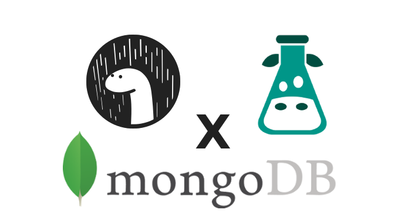

[](LICENSE)
[](https://codeclimate.com/github/lamualfa/dn-i18next-mongo-backend/maintainability)
[](https://github.com/lamualfa/dn-i18next-mongo-backend)

## Are you a NodeJS user? If `true`, we provide the same library for NodeJS. See: [Mongo Backend for NodeJS](https://github.com/lamualfa/i18next-node-mongo-backend)

# Integrate [i18next](https://github.com/i18next/i18next) with [MongoDB](https://www.mongodb.com/) in Deno 🦖

<div align="center">

<!-- Inspired from https://github.com/grikomsn -->
</div>

# Introduction

This is a [i18next](https://github.com/i18next/i18next) backend to be used in Deno. It will load resources from a [MongoDB](https://www.mongodb.org) database.

# Usage

```ts
import i18next from 'https://deno.land/x/i18next/index.js'
import { Backend } from 'https://raw.githubusercontent.com/lamualfa/dn-i18next-mongo-backend/master/mod.ts'

i18next.use(Backend).init({
  // Backend Options
  backend: options,
})
```

# Backend Options

```js
{
  // Database Name
  dbName: '<DB Name>', // Required

  // Or

   // MongoDB standard configuration
  host: '<DB Host>',
  port: 27017,

  // Or

  // Use collection - See: https://doc.deno.land/https/deno.land/x/mongo/mod.ts#Collection
  collection: Collection,

  // MongoDB authentication. Remove it if not needed
  user: '<DB User>',
  password: '<DB Password>',

  // Collection name in database will be used to store i18next data
  colName: 'i18n',

  // MongoDB field name
  // Language data
  langFieldName: 'lang',
  // Namespace data
  nsFieldName: 'ns',
  // Data
  dataFieldName: 'data',

  // Remove MongoDB special character from field name - See https://jira.mongodb.org/browse/SERVER-3229
  sanitizeFieldName: true,

  // Error handlers
  readOnError: console.error,
  readMultiOnError: console.error,
  createOnError: console.error,

  // MongoClient Options - See: https://doc.deno.land/https/deno.land/x/mongo/mod.ts#ClientOptions
  mongodb: ClientOptions
};
```

## Example Backend Options

#### Connect with `host` and `port`:

```js
{
  host: 'localhost',
  port: 27017,
  dbName: 'test' // Required field
}
```

#### Connect with `collection` instance (_Recommended_):

If you already have your own connection, use this to avoid useless connections

```js
{
  collection: Collection, // See: https://doc.deno.land/https/deno.land/x/mongo/mod.ts#Collection
  dbName: 'test', // Required field
}
```

## Example of the MongoDB document that will be created:

```json
// Key name is according to provided in options
{
  "lang": "en-US",
  "ns": "translations",
  "data": {
    "key": "Thank you!"
  }
}
```
